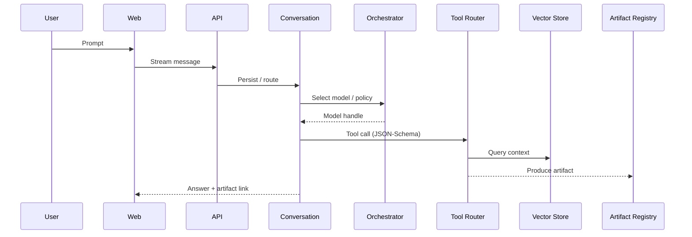

# PENNY Documentation Plan & Templates (v0.1)

**Owner:** MADFAM Eng · **Audience:** contributors, operators, security, product

> Goal: ship a complete, **actionable docs seed** that makes the codebase self‑explanatory, safe to
> operate, and easy to extend.

---

## 1) What to add (prioritized)

### P0 – Must‑have for MVP

- **Getting Started** (local stack + first run, 10‑minute success)
- **Architecture Overview** (components, data flow, sequence)
- **OpenAPI Reference** (generated) + **Client SDK usage**
- **Tool & Plugin Guide** (JSON‑Schema contracts, security model)
- **Artifacts & Widgets** (definition, viewer, how to add one)
- **Security & Privacy** (RBAC, egress policy, PII/DLP)
- **Observability** (tracing, metrics, dashboards, log fields)
- **Runbooks** (auth outage, vector DB fail, model pool down)

### P1 – Should‑have for v1

- **Data Model & ERD** (entities, relationships, retention)
- **Code Styleguide** (TS/React/Tailwind, commit rules)
- **UI/UX Guidelines** (shadcn patterns, accessibility, i18n)
- **Release & Versioning** (Changesets, tags, Docker images)
- **Environments & Config** (dev/staging/prod, feature flags)
- **ADR Index** (+ template)

### P2 – Nice‑to‑have / Ops maturity

- **SLA/SLO/SLI** policy & dashboards
- **Disaster Recovery** (backups, restore drills)
- **Cost Management** (quotas, caching, model routing)
- **Multi‑tenancy & White‑label Guide** (themes, branding, limits)

---

## 2) Docs sitemap (proposed)

```
/docs
  GETTING_STARTED.md
  ARCHITECTURE.md
  API.md                    # links to generated OpenAPI site
  TOOLS_AND_PLUGINS.md
  ARTIFACTS_AND_WIDGETS.md
  SECURITY.md
  OBSERVABILITY.md
  DATA_MODEL.md
  STYLEGUIDE.md
  UI_UX_GUIDELINES.md
  RELEASE_AND_VERSIONING.md
  ENVIRONMENTS.md
  MULTITENANCY_AND_WHITELABEL.md
  /RUNBOOKS
    auth-outage.md
    vector-db-degraded.md
    model-orchestrator-down.md
  /PLAYBOOKS
    new-tenant-onboarding.md
    incident-response-30-60-90.md
  /ADRS
    ADR-0001.md
    ADR-0002.md
    ADR-0003.md
```

---

## 3) Ready‑to‑use templates

### 3.1 ADR template (`/docs/ADRS/ADR-XXXX.md`)

```markdown
# ADR-XXXX: <Title>

- **Status:** Proposed | Accepted | Rejected | Superseded by ADR-YYYY
- **Context:** <Problem, constraints, stakeholders>
- **Options considered:** <A, B, C>
- **Decision:** <Chosen option + why>
- **Consequences:** <Positive, negative, rollbacks>
- **References:** <Links, issues>
```

### 3.2 RFC / Feature brief template (`/docs/RFCs/000-<slug>.md`)

```markdown
# RFC: <Feature/Change>

**Owner:** <name> · **Reviewers:** <names> · **Target release:** <vX.Y>

## Summary

<One paragraph>

## Goals / Non-goals

- Goals: ...
- Non-goals: ...

## Design

- API/Schema changes
- Data model changes
- UX flows (screenshots / diagrams)

## Risks & Mitigations

## Rollout Plan

- Flags, migrations, backfill, monitoring

## Acceptance Criteria
```

### 3.3 Runbook template (`/docs/RUNBOOKS/<incident>.md`)

```markdown
# Runbook: <Incident>

**Severity:** P0 | P1 | P2 · **Last reviewed:** <date>

## Symptoms

- ...

## Quick Triage (first 10 minutes)

1. Check dashboards: <links>
2. Page on-call: <how>
3. Toggle kill-switch/feature flag if applicable

## Detailed Steps

- Step 1: bash / API call / dashboard
- Step 2: ...

## Rollback / Recovery

## Post-incident

- Timeline, root cause, follow-ups
```

### 3.4 Playbook template (`/docs/PLAYBOOKS/<play>.md`)

```markdown
# Playbook: <Play>

**Owner:** <team> · **Trigger:** <event>

## Steps

- Step 1
- Step 2

## Artifacts

- Templates, emails, dashboards

## Metrics

- Leading and lagging indicators
```

### 3.5 Tool manifest template (JSON Schema) (`/packages/tool-registry/<tool>/manifest.json`)

```json
{
  "name": "<tool_name>",
  "version": "0.1.0",
  "description": "<what it does>",
  "permissions": ["datasource:read", "slack:write"],
  "parameters": {
    "type": "object",
    "properties": {
      "slug": { "type": "string" },
      "filters": { "type": "object", "additionalProperties": true }
    },
    "required": ["slug"]
  },
  "timeouts": { "seconds": 30 },
  "rateLimits": { "rpm": 60 },
  "ui": { "admin": true, "endUser": true }
}
```

### 3.6 Plugin README template (`/workers/plugins/<plugin>/README.md`)

```markdown
# <Plugin Name>

## What it does

## Config

- ENV vars: ...
- Secrets: ...

## Permissions

- Required roles and scopes

## Usage

- Example chat prompts
- Example API call
```

### 3.7 PR template (`/.github/PULL_REQUEST_TEMPLATE.md`)

```markdown
## Summary

## Changes

- [ ] Tests
- [ ] Docs
- [ ] Backward compatible

## Screenshots / Artifacts

## Checklist

- [ ] Lint passes
- [ ] Type checks
- [ ] E2E happy path
- [ ] Updated ADRs if needed
```

### 3.8 Issue templates (`/.github/ISSUE_TEMPLATE/`)

- **bug_report.yml**

```yaml
name: Bug report
description: Help us fix an issue
labels: [bug]
body:
  - type: textarea
    id: what-happened
    attributes:
      label: What happened?
      description: Include logs, steps, expected vs actual
      placeholder: ...
    validations:
      required: true
```

- **feature_request.yml**

```yaml
name: Feature request
description: Suggest an idea
labels: [enhancement]
body:
  - type: textarea
    id: problem
    attributes:
      label: Problem to solve
    validations:
      required: true
```

---

## 4) Core docs – starter content

### 4.1 Architecture Overview (`/docs/ARCHITECTURE.md`)

````markdown
# Architecture

> Chat → Tool → Artifact in one flow.

## Components

- Web (React) · API (Fastify) · Orchestrator · Tool Workers · Vector DB · Postgres · Object Store ·
  Observability

## Sequence (happy path)


````

````

### 4.2 Data Model & ERD (`/docs/DATA_MODEL.md`)
```markdown
# Data Model

```mermaid
classDiagram
  class Tenant { id uuid }
  class Workspace { id uuid }
  class Conversation { id uuid }
  class Message { id uuid }
  class Artifact { id uuid type mime version }
  class Tool { name version }
  class Plugin { name version }
  class VectorIndex { id name }

  Tenant --> Workspace : 1..N
  Workspace --> Conversation : 1..N
  Conversation --> Message : 1..N
  Conversation --> Artifact : 1..N
  Plugin --> Tool : 1..N
  VectorIndex --> Artifact : indexes >
````

````

### 4.3 Security & Privacy (`/docs/SECURITY.md`)
```markdown
# Security & Privacy
- RBAC roles: admin, manager, creator, viewer
- OIDC/SAML (opt), MFA
- Data egress controls for external models
- PII/DLP redaction toggles
- Audit every tool call, data access, model selection
````

### 4.4 Observability (`/docs/OBSERVABILITY.md`)

```markdown
# Observability

- Tracing: OpenTelemetry (trace ids across chat→tool→artifact)
- Metrics: TTFT, p50/p95, tool success, cache hits, GPU util
- Dashboards: Jaeger, Grafana (if used)
- Alerts: timeouts, auth failures, abnormal egress, cost spikes
```

---

## 5) Docs site options

### Option A: **MkDocs Material** (simple, fast)

- Pros: markdown‑first, search, great for engineers
- Add `mkdocs.yml`:

```yaml
site_name: PENNY Docs
theme:
  name: material
nav:
  - Getting Started: docs/GETTING_STARTED.md
  - Architecture: docs/ARCHITECTURE.md
  - API: docs/API.md
  - Tools & Plugins: docs/TOOLS_AND_PLUGINS.md
  - Security: docs/SECURITY.md
  - Observability: docs/OBSERVABILITY.md
```

### Option B: **Docusaurus** (heavier, versioned docs)

- Pros: versioning, i18n, React components
- Use for public SaaS docs later.

---

## 6) Automation

- **Generate API.md** from OpenAPI on every build.
- **Docs CI**: link check, Mermaid lint, spell check (e.g., `codespell`), broken anchors.
- **Prose lint**: optional `vale` rules for tone and clarity.

**GitHub Action (docs CI)**

```yaml
name: docs-ci
on: [push, pull_request]
jobs:
  build:
    runs-on: ubuntu-latest
    steps:
      - uses: actions/checkout@v4
      - uses: actions/setup-node@v4
        with: { node-version: 20 }
      - run: pnpm install --frozen-lockfile
      - run: pnpm -w docs:build # generate API.md, etc.
      - run: npx markdown-link-check -q -c .mlc.json '**/*.md'
```

---

## 7) Owner assignments (suggested)

- **Docs platform**: @platform-eng
- **Security**: @security
- **Observability**: @sre
- **API & SDK**: @backend
- **Tooling/Plugins**: @integrations
- **UI/UX**: @design

---

## 8) Definition of Done (docs)

- Linked from README
- Has at least one diagram/tested render on GitHub
- Includes acceptance criteria or run commands
- CI checks pass (links, spell, build)
