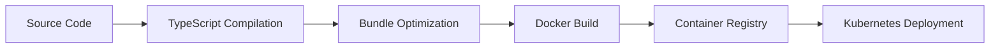

# PENNY Architecture

## Overview

PENNY is built as a modern, cloud-native application using a microservices architecture. The
platform is designed for scalability, security, and extensibility.

## System Architecture

```
┌─────────────────────────────────────────────────────────────────┐
│                         Load Balancer                           │
│                    (nginx/ALB/CloudFront)                       │
└─────────────────┬───────────────────────┬─────────────────────┘
                  │                       │
        ┌─────────▼──────────┐  ┌────────▼────────┐
        │   Web Application   │  │  Admin Dashboard │
        │    (React/Vite)     │  │   (Next.js 14)   │
        └─────────┬──────────┘  └────────┬────────┘
                  │                       │
        ┌─────────▼───────────────────────▼─────────┐
        │              API Gateway                  │
        │            (Fastify/Node.js)              │
        └─────────┬─────────────────────────────────┘
                  │
    ┌─────────────┼─────────────────────────────────┐
    │             │                                 │
┌───▼──────┐ ┌───▼──────┐ ┌──────────┐ ┌──────────▼──────────┐
│WebSocket │ │   REST   │ │  Queue   │ │   File Storage      │
│ Handler  │ │   API    │ │ Workers  │ │ (Local/S3/GCS)      │
└──────────┘ └──────────┘ └──────────┘ └─────────────────────┘
    │             │             │                   │
┌───▼─────────────▼─────────────▼───────────────────▼───┐
│                    Service Layer                       │
├────────────────────────────────────────────────────────┤
│ • Model Orchestration  • Tool Execution               │
│ • Authentication       • File Management              │
│ • Multi-tenancy       • Metrics Collection            │
└────────────────────────┬───────────────────────────────┘
                         │
         ┌───────────────┼────────────────┐
         │               │                │
    ┌────▼─────┐  ┌─────▼──────┐  ┌─────▼──────┐
    │PostgreSQL│  │   Redis    │  │   Vector   │
    │          │  │  (Cache/   │  │  Database  │
    │          │  │  PubSub)   │  │ (pgvector) │
    └──────────┘  └────────────┘  └────────────┘
```

## Core Components

### 1. Frontend Applications

#### Web Application (React + Vite)

- **Purpose**: Main user interface for AI interactions
- **Technologies**: React 18, TypeScript, Tailwind CSS, Zustand
- **Key Features**:
  - Real-time chat interface
  - Artifact visualization
  - Tool execution UI
  - File management

#### Admin Dashboard (Next.js 14)

- **Purpose**: Platform administration and monitoring
- **Technologies**: Next.js 14, React, TypeScript, Tailwind CSS
- **Key Features**:
  - Tenant management
  - User administration
  - Billing and subscriptions
  - System monitoring
  - Analytics dashboards

### 2. Backend Services

#### API Gateway

- **Framework**: Fastify
- **Responsibilities**:
  - Request routing
  - Authentication/Authorization
  - Rate limiting
  - API documentation (OpenAPI)
  - WebSocket handling

#### Core Services

##### Model Orchestration Service

```typescript
interface ModelOrchestrator {
  providers: Map<string, ModelProvider>;
  router: ModelRouter;
  queue: PQueue;

  generateCompletion(request: CompletionRequest): Promise<CompletionResponse>;
  generateStream(request: CompletionRequest): AsyncGenerator<CompletionChunk>;
}
```

##### Tool Execution Engine

```typescript
interface ToolExecutor {
  registry: ToolRegistry;
  executor: ToolExecutor;
  sandbox: ToolSandbox;

  execute(toolName: string, params: any): Promise<ToolResult>;
}
```

### 3. Data Layer

#### PostgreSQL Database

- **Purpose**: Primary data store
- **Features**:
  - Multi-tenant data isolation
  - Row-level security (RLS)
  - Full-text search
  - JSONB for flexible schemas

#### Redis

- **Purpose**: Caching and real-time features
- **Use Cases**:
  - Session storage
  - Rate limiting
  - Pub/Sub for real-time updates
  - Model response caching

#### pgvector

- **Purpose**: Vector embeddings storage
- **Use Cases**:
  - Semantic search
  - Document similarity
  - RAG (Retrieval Augmented Generation)

## Multi-tenancy Architecture

### Tenant Isolation

```sql
-- Row Level Security Policy
CREATE POLICY tenant_isolation ON conversations
  USING (tenant_id = current_setting('app.current_tenant_id')::uuid);
```

### Tenant Resolution Strategies

1. **Subdomain-based**: `acme.penny.ai`
2. **Path-based**: `penny.ai/acme`
3. **Header-based**: `X-Tenant-ID: acme`

## Security Architecture

### Authentication Flow

```
┌────────┐      ┌─────────┐      ┌──────────┐      ┌──────────┐
│ Client ├──1──►│   API   ├──2──►│   Auth   ├──3──►│   JWT    │
│        │◄──6──┤ Gateway │◄──5──┤ Service  │◄──4──┤ Provider │
└────────┘      └─────────┘      └──────────┘      └──────────┘
```

1. Client sends credentials
2. API Gateway forwards to Auth Service
3. Auth Service validates with JWT Provider
4. JWT token generated
5. Token returned to API Gateway
6. Token sent to client

### Encryption

- **At Rest**: AES-256-GCM with per-tenant keys
- **In Transit**: TLS 1.3
- **Key Management**: HSM/KMS integration ready

## Scalability Patterns

### Horizontal Scaling

```yaml
# Kubernetes Deployment
apiVersion: apps/v1
kind: Deployment
metadata:
  name: api-gateway
spec:
  replicas: 3
  strategy:
    type: RollingUpdate
    rollingUpdate:
      maxUnavailable: 1
      maxSurge: 1
```

### Queue-based Processing

```typescript
// Async job processing
const queue = new Queue('ai-completions', {
  redis: { host: 'redis', port: 6379 },
});

queue.process('generate', async (job) => {
  const { request, tenantId } = job.data;
  return await orchestrator.generateCompletion(request, { tenantId });
});
```

### Caching Strategy

1. **API Response Cache**: Redis with TTL
2. **Model Response Cache**: Deduplicate similar prompts
3. **Static Asset Cache**: CDN integration
4. **Database Query Cache**: Materialized views

## Monitoring and Observability

### Metrics Collection

```typescript
// Prometheus metrics
const httpDuration = new Histogram({
  name: 'http_request_duration_seconds',
  help: 'Duration of HTTP requests in seconds',
  labelNames: ['method', 'route', 'status'],
});
```

### Logging Architecture

```
Application → Pino Logger → Log Aggregator → ElasticSearch → Kibana
                ↓
            CloudWatch
```

### Distributed Tracing

```typescript
// OpenTelemetry integration
import { trace } from '@opentelemetry/api';

const tracer = trace.getTracer('penny-api');
const span = tracer.startSpan('model.completion');
```

## Development Architecture

### Monorepo Structure

```
penny/
├── apps/
│   ├── api/          # API Gateway
│   ├── web/          # React Web App
│   └── admin/        # Admin Dashboard
├── packages/
│   ├── core/         # Core business logic
│   ├── database/     # Prisma schema & client
│   ├── shared/       # Shared utilities
│   ├── ui/           # UI component library
│   ├── security/     # Security utilities
│   └── telemetry/    # Monitoring & metrics
└── tools/            # Build tools & scripts
```

### Build Pipeline



## Performance Optimizations

### API Gateway

- Request coalescing for duplicate AI calls
- Response streaming for real-time updates
- Connection pooling for database

### Frontend

- Code splitting and lazy loading
- Service Worker for offline capability
- Virtual scrolling for large lists
- Optimistic UI updates

### Database

- Indexed columns for common queries
- Partitioned tables for time-series data
- Read replicas for analytics queries
- Connection pooling with pgBouncer

## Disaster Recovery

### Backup Strategy

- **Database**: Daily automated backups with point-in-time recovery
- **File Storage**: Cross-region replication
- **Configuration**: Version controlled in Git

### High Availability

- Multi-AZ deployment
- Auto-scaling groups
- Health checks and automatic recovery
- Circuit breakers for external services
