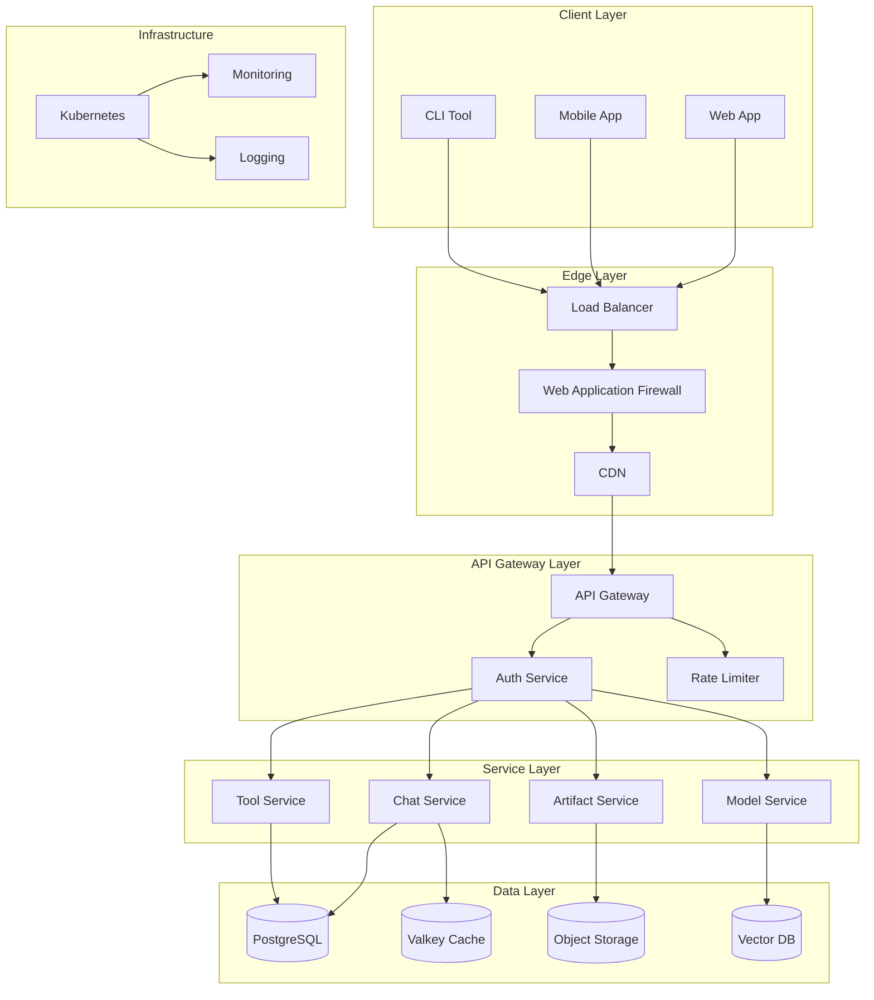

# Architecture Documentation

This section contains comprehensive documentation about the PENNY platform's architecture, design decisions, and technical implementation.

## Table of Contents

1. [System Architecture Overview](./overview.md) - High-level system design and components
2. [Database Schema](./database.md) - Database design and relationships
3. [Multi-tenant Design](./multi-tenant.md) - Tenant isolation and multi-tenancy
4. [API Architecture](./api-architecture.md) - REST API design patterns
5. [WebSocket Architecture](./websocket-architecture.md) - Real-time communication design
6. [Security Architecture](./security-architecture.md) - Security model and implementation
7. [Tool System](./tool-system.md) - Tool registry and execution architecture
8. [Artifact System](./artifact-system.md) - Artifact storage and visualization
9. [Billing Architecture](./billing-architecture.md) - Subscription and billing system
10. [Monitoring & Analytics](./monitoring-analytics.md) - Observability architecture

## Architecture Overview

PENNY is built as a cloud-native, multi-tenant platform following microservices architecture
principles. The system is designed for high availability, scalability, and security.

## System Architecture

## Key Design Principles

### 1. Multi-Tenancy

- Complete data isolation at database level
- Tenant-specific encryption keys
- Resource quotas per tenant
- Customizable features and limits

### 2. Security First

- Zero-trust network architecture
- End-to-end encryption
- Regular security audits
- Compliance with SOC2, GDPR

### 3. Scalability

- Horizontal scaling for all services
- Auto-scaling based on metrics
- Efficient resource utilization
- Global distribution ready

### 4. Extensibility

- Plugin architecture for tools
- Custom model integration
- Webhook support
- API-first design

## Service Architecture

### API Gateway

- Request routing
- Authentication/Authorization
- Rate limiting
- Request/Response transformation
- WebSocket support

### Chat Service

- Conversation management
- Message streaming
- Context preservation
- Multi-model support

### Tool Service

- Tool registry
- Execution sandbox
- Permission management
- Result caching

### Artifact Service

- Artifact storage
- Version control
- Access control
- CDN distribution

### Model Service

- Model routing
- Load balancing
- Fallback handling
- Performance monitoring

## Data Architecture

### Primary Database (PostgreSQL)

- Tenant isolation via RLS
- JSONB for flexible schemas
- Partitioning for scale
- Read replicas for performance

### Cache Layer (Valkey)

- Session storage
- Temporary data
- Rate limit counters
- Pub/sub for events

### Object Storage

- Artifact storage
- File attachments
- Model weights
- Backup storage

### Vector Database

- Embedding storage
- Similarity search
- RAG support
- Tenant isolation

## Deployment Architecture

### Container Orchestration

- Kubernetes for container management
- Helm charts for deployment
- GitOps with ArgoCD
- Multi-region support

### CI/CD Pipeline

- GitHub Actions for automation
- Automated testing
- Security scanning
- Progressive rollouts

### Monitoring & Observability

- OpenTelemetry for tracing
- Prometheus for metrics
- ELK stack for logging
- Custom dashboards

## Security Architecture

### Network Security

- Private subnets
- Network policies
- TLS everywhere
- DDoS protection

### Application Security

- OWASP compliance
- Input validation
- Output encoding
- Security headers

### Data Security

- Encryption at rest
- Encryption in transit
- Key rotation
- Audit logging

## Performance Targets

- API Response: < 100ms p50
- Chat Response: < 600ms TTFT
- Availability: 99.9% SLA
- RPO: 1 hour
- RTO: 4 hours
